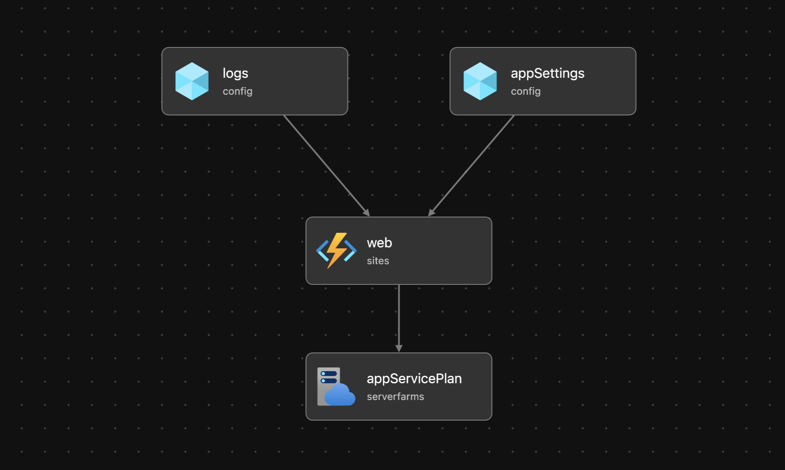

# Simple FastMCP AZD Template

The most basic FastMCP application as an AZD template ready for Azure App Service



## Usage

1. Clone the repo and install AZD

2. Login to your Azure account.
```bash
azd auth login
```
> NOTE: if using a government cloud, you will need to configure azd to use that cloud before logging in
```bash
azd config set cloud.name AzureUSGovernment
azd auth login
```

3. Run the following command to build a deployable copy of your application, provision the template's infrastructure to Azure and also deploy the applciation code to those newly provisioned resources.

```bash
azd up
```
> NOTE: the first run will prompt you ```Enter a unique environment name:``` This will be used as a prefix for the resource group that will be created to hold all Azure resources. This name should be unique within your Azure subscription.

This command will prompt you for the following information:
- `Azure Location`: The Azure location where your resources will be deployed.
- `Azure Subscription`: The Azure Subscription where your resources will be deployed.

> NOTE: This may take a while to complete as it executes three commands: `azd package` (builds a deployable copy of your application), `azd provision` (provisions Azure resources), and `azd deploy` (deploys application code). You will see a progress indicator as it packages, provisions and deploys your application.

4. Then make changes to app.py and run `azd deploy` again to update your changes.

## Access the free App Service Tier

As the template comes, it is set to a basic plan (see [pricing](https://azure.microsoft.com/en-au/pricing/details/app-service/windows/#pricing) guide), but if you want to get started for free, you can easily update the template before you run `azd up` to leverage the free plan or the discounted developer plan. 

Go to the [/infra/resources.bicep](https://github.com/Azure-Samples/azd-simple-fastapi-appservice/blob/main/infra/resources.bicep) file and update line 58, where the SKU is currently set to `“B1”`. Change this to `“F1”` to deploy up to 10 App Service apps for free on the **free plan** (or `“D1”`  for the **discounted developer rate** if you have more than 10 to deploy concurrently).  

## Notes

This uses the F1 (free) SKU for app service, which has limited CPU and RAM resources.

See the [pricing calculator](https://azure.microsoft.com/en-au/pricing/calculator/) for details on paid SKUs replace the SKU option with a suitable choice.
